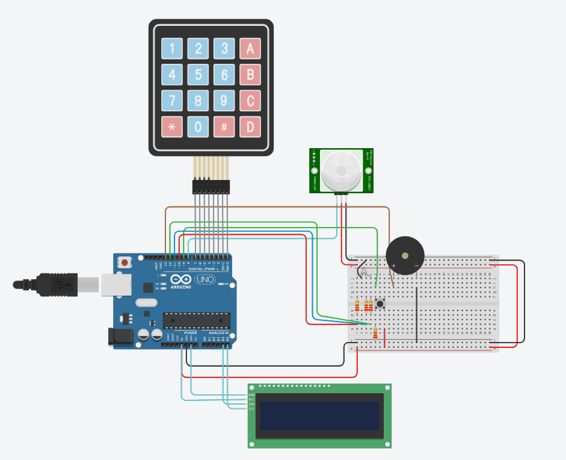

# Mini signalizacijos sistema su Arduino

## Projekto aprašymas
Šis projektas imituoja paprastą signalizacijos sistemą. Sistema aptinka judesį naudodama PIR jutiklį ir įjungia garsinį bei vizualinį signalą (buzzer ir RGB LED(aptikus signala - Raudona spalva, neaptinkant signalo - žalia spalva). Išjungti signalizaciją galima tik suvedus teisingą slaptažodį, kitu atvėju signalizacija taip ir neišsijungs, kol nebus įvestas teisingas slaptažodis. Tokios sistemos gali būti naudojamos patalpų apsaugai ar automatiniam judesio aptikimui.

## Naudoti komponentai
- Arduino Uno
- PIR judesio jutiklis
- RGB LED
- Rezistoriai
- Buzzer
- Breadboard
- LCD 16x2 (I2C)
- Mygtukas (Pushbutton)
- Keypad 4x4
- Jungiamieji laidai

## Schema
Komponentų sujungimas:
- PIR OUT → D8  
- RGB LED → D12, D11, D10 (per rezistorių į GND)  
- Buzzer → D13
- LCD I2C: Arduino GND → GND, 5V → VCC, A4 → SDA, A5 → SCL
- Keypad: ROWS → D7, D6, D5, D4. COLS → D3, D2, D1, D0.
- Maitinimas: 5V ir GND iš Arduino  

  

## Programinė dalis
Naudojau Arduino IDE / Tinkercad aplinką. Kodas nuskaito PIR jutiklio signalą ir pagal jį įjungia arba išjungia LED bei buzzer. (Visas kodas yra "main" faile).

## Kas veikia / kas neveikė
Kas veikia: Dabar viskas veikia puikiai, sistema aptinka signalą, įjungia LED ir buzzer, o po judesio pabaigos išjungia.
Kas neveikė: Buvo taip, jog buvau ne taip, kaip reikia sujungęs porą laidų, todėl tik paleidus simuliaciją, Buzzer'is veikdavo be perstojo (visą laiką pypdavo).

## Ateities patobulinimai
- Pridėti LCD ekraną, kuris rodytų, kiek kartų aptiktas judesys.
- Prijungti Wi-Fi modulį, kad praneštų apie judesį telefonu.
- Vietoje paprasto buzzerio naudoti garsinė sireną.

## Išvada
Projektas pademonstravo, kaip galima sujungti sensorių ir aktuatorių naudojant Arduino. Sistema veikia kaip paprasta signalizacija, tinkama mokumuisi ir pagrindiniams automatizacijos principams suprasti.

<video src="FirstHomeWork.mp4" width="600" controls></video>
