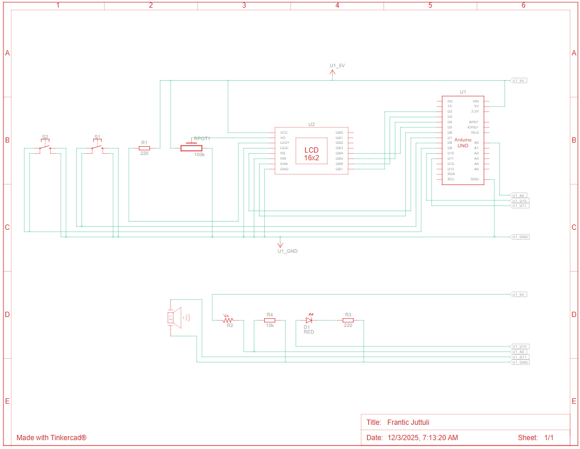

# Home Security Alarm System

This project is a simple home security alarm system built using an Arduino UNO, a 16x2 LCD display, a photoresistor (LDR), two push buttons, a piezo buzzer, and an LED indicator.
The system detects sudden changes in light (simulating motion), enters a PIN entry mode, and activates an alarm if the user fails to enter the correct PIN.
The LCD display guides the user through the system states: DISARMED, ARMED, PIN entry, and ALARM.

# Problem Statement

Security systems often rely on sensors and PIN-based access control to prevent unauthorized entry.
The goal of this project is to design a basic but functional alarm system using minimal hardware components, focusing on embedded system principles such as input handling, state machines, persistent memory, and user interaction.
The system:
- Detects "motion" using an LDR as a light-change sensor.
- Allows the user to ARM and DISARM the system.
- Requires a 4-digit PIN to dismiss a detected intrusion.
- Stores the correct PIN using EEPROM, preserving it after power loss.
- Provides clear state feedback through a 16x2 LCD.
- Uses push buttons for PIN entry (digit cycling + next digit).
- Triggers an alarm (LED + piezo buzzer) on incorrect PIN.

# Components
- Arduino UNO — x1
- 16x2 LCD display — x1
- Piezo buzzer — x1
- LED — x1
- 220 Ω resistor (LED) — x1
- Potentiometer (LCD contrast) — x1
- Photoresistor (LDR) — x1
- 10k Ω resistor (voltage divider for LDR) — x1
- Push buttons — x2
- Breadboard — x1
- Wires — x31

# Design Overview

1. DISARMED Mode
- System is inactive.
- LCD displays “ALARM OFF” and instructs user to press button B to arm the system.
- No motion detection is performed.

2. ARMED Mode
- System actively monitors LDR input.
- A sudden light-change triggers a potential intrusion.
- LCD displays “Monitoring…” during this state.
- When motion is detected → transitions to PIN entry.

3. PIN Entry Mode
- The user must enter a 4-digit PIN.
- Two push buttons are used:
    -Button A: cycles digit (0 → 9 → 0).
    -Button B: confirms digit and moves to the next position.
- LCD displays arrow indicating which digit is currently being edited.
- If PIN matches EEPROM → system returns to DISARMED.
- If PIN is incorrect → transitions to ALARM.

4. ALARM Mode
- LED flashes and piezo buzzer sounds.
- LCD displays “INTRUDER!”.
- User is prompted to re-enter the PIN to shut down the alarm.
- Correct PIN → back to DISARMED.

5. EEPROM Storage
- PIN is stored in EEPROM across power cycles.
- A marker byte is used to check whether a PIN exists; otherwise, default PIN 0000 is created.
- System loads PIN during boot sequence.

# Code

The project is implemented in C++ using Arduino IDE and includes:
- LiquidCrystal.h for LCD interface
- EEPROM.h for persistent PIN storage
- A finite state machine controlling alarm states
- Non-blocking input handling
- Algorithms for:
- PIN entry
- Motion detection (LDR threshold)
- Alarm activation
- UI arrow navigation
- The full code is contained in main

# Wiring

# What worked / What didn't

What worked:
- LCD successfully displayed system states and PIN input interface.
- EEPROM correctly stored and restored the security PIN.
- Input using only two buttons worked reliably.
- LDR correctly triggered the alarm once wiring was correct.
- Alarm state (LED + buzzer) activated and reset as expected.

What didn’t:
- Initially, the LDR always returned 1023 due to incorrect voltage-divider wiring.
- LCD text behaved unexpectedly until cursor positions and spacing were fine-tuned.
- Button bounce caused unwanted double increments until debounce logic was added.

# Future improvements

- Add a menu to change the PIN from the LCD interface.
- Add a real PIR motion sensor for more accurate detection.
- Add a timed ARMED delay (e.g., 10s exit time).
- Add a “HIDDEN MODE” so system arms only after a long button press.
- Log failed attempts to EEPROM.
- Add serial debugging output.
