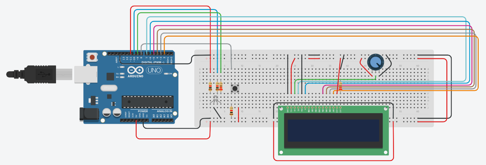
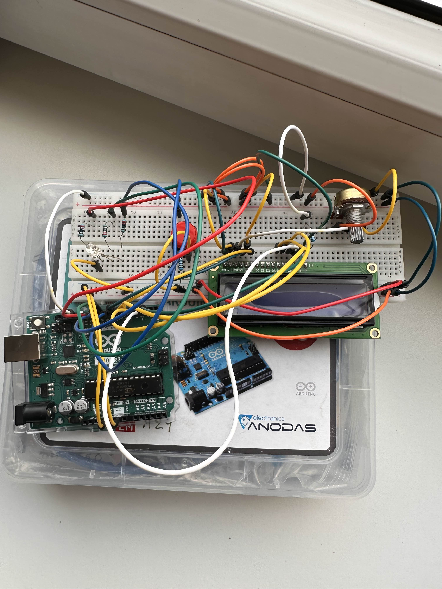

# Reaction Time Tester
This project is a Reaction Time Tester built with Arduino, an RGB LED, a push button, and a 16x2 LCD display.
It measures how quickly a user can respond to a visual stimulus and displays minimum, maximum, and average reaction times after 5.

# Problem statement
Measuring human reaction time can provide insight into reflexes and attention. This project aims to build a simple, interactive device that:
  - Randomly waits between 1-5 seconds,
  - Leghts up an LED as a visual cue,
  - Measures the time between the cue and the user's button press,
  - Tracks statistics across multiple attempts.

# Components
  - Arduino UNO  -  x1  -  Main microcontroller
  - RGB LED (common anode)  -  x1  -  Visual stimulus
  - 220 Ω resistors  -  x3  -  For each RGB LED channel
  - 1k Ω resistors  -  x2  -  For push button and LCD display
  - Push button  -  x1  -  User input
  - 16x2 LCD display  -  x1  -  Parallel interface
  - Potentiometer  -  x1  -  Adjust LCD contrast
  - Breadboard  -  1x  -  That is the base of the project
  - Wires  -  x26  -  To connect all components

# Design Overview
1. Idle phase - RGB LED lights up red.
2. Start - User presses the button to initiate a round.
3. Random delay (1-5 s) - LED stays red.
4. GO signal - LED turns green, reaction timer starts.
5. User presses the button - Timer stops, reaction time is displayed on LCD.
6. After 5 rounds, LCD displays average, minimum, and maximum raction times.
7. The system then resets when the button is pressed again.

# Wiring / Schematic

| LCD | Connection |
| ------------- | ------------- |
| VSS | GND |
| VDD | 5V |
| V0 | Potentiometer middle pin |
| RS | Arduino pin 7 |
| RW | GND |
| E | Arduino pin 6 |
| D4 | Arduino pin 5 |
| D5 | Arduino pin 4 |
| D6 | Arduino pin 3 |
| D7 | Arduino pin 2 |
| A | 5V |
| K | GND with 1k resistor |

| Potentiometer | Connection |
| ------------- | ---------- |
| Right | GND |
| Middle | LCD V0 |
| Left | 5V |

| RGB | Connection |
| ----------- | ---------- |
| RED | Arduino pin 11 |
| BLUE | Arduino pin 10 |
| GREEN | Arduino pin 9 |
| Anode | 5V |

| Push button | Connection |
| ----------- | ---------- |
| Push button | Arduino pin 8 |

# Real Setup

# Code
This project is implemented in C++ using the Arduino IDE, using:
  - LiquidCrystal.h for LCD control
  - millis() for non-blocking timing
  - Simple state machine to handle wait, stimulus, and reaction phases
  - Min, max, and average calculations over multiple trials
The full code can be cound in main.

# What worked / What didn't

What worked:
  - Using a tinkercad there were no problems, everything worked perfectly.
  - Push button worked perfect.
What didn't:
  - I've experienced some wiring mistakes, there were a lot of difficulties to fix my project, because I didn't knew what       exactly was wrong (As I now know, breadboard is splitted into two parts in the middle, that was the biggest problem to      manage)
  - LCD display didn't worked properly, it's very familiar with the first problem I've experienced.
  - RGB led didn't worked properly (first problem is familiar in here as well, but that was not the main case). I needed to     configure my code to set the proper colors.

# Future improvements

- Add sound stimulus using a buzzer for audio reaction test
- Log reaction times to SD card
- Add histogram visualization on the LCD
- Add multiplayer mode with two buttons

# Demo Video

https://github.com/M4rky5s/Robotics/blob/main/SecondHW/SecondHW.mp4
