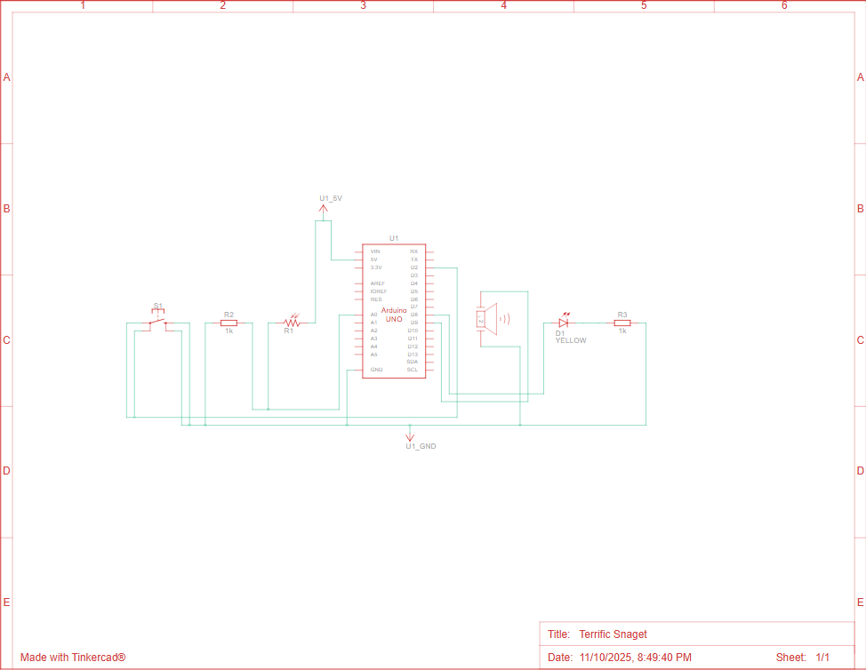

# Smart Light
This project is a Smart Streetlight built with Arduino UNO, a photoresistor (LDR), a push button, a buzzer, and a 16x2 LCD display.
The LED automatically turns ON or OFF depending on the ambient light level or can be manually controlled via a button.
The LCD displays the current mode, LED state, light sensor value, and the threshold level.

# Problem statement
In modern lighting systems, energy efficiency is essential.
The goal of this project is to design an automatic light control system that adjusts to environmental light conditions, while also allowing manual override when needed.
The system:
  - Detects ambient brightness using a photoresistor (LDR).
  - Turns ON the light in darkness and OFF in daylight (AUTO mode).
  - Allows the user to manually toggle the light (MANUAL mode).
  - Stores the selected mode in EEPROM to remember it after power loss.
  - Displays real-time data on a 16x2 LCD.

# Components
  - Arduino UNO  -  x1
  - Yellow LED  -  x1
  - 220 Ω resistors  -  x1 
  - 1k Ω resistors  -  x2
  - Push button  -  x1
  - 16x2 LCD display  -  x1
  - Potentiometer  -  x1
  - Piezo - x1
  - Breadboard  -  x1
  - Photoresistor - x1
  - Wires - x23

# Design Overview
1. AUTO Mode
   - The system continuously reads LDR input.
   - If light < threshold → LED turns ON.
   - If light > threshold → LED turns OFF.
2. MANUAL Mode
   - The user controls the LED manually via short button presses.
   - LDR input is ignored.
3. Mode Switching
   - Hold the button for 2 seconds → switch between AUTO and MANUAL.
   - A buzzer beeps to confirm the mode change.
   - Mode is saved in EEPROM.
4. LCD Display
   - 1st line: shows current mode (AUTO/MANUAL) and LED status (ON/OFF).
   - 2nd line: shows LDR reading and threshold value.

# Wiring / Schematic

| LCD | Connection |
| ------------- | ------------- |
| VSS | GND |
| VDD | 5V |
| V0 | Potentiometer middle pin |
| RS | Arduino pin 12 |
| RW | GND |
| E | Arduino pin 11 |
| D4 | Arduino pin 5 |
| D5 | Arduino pin 4 |
| D6 | Arduino pin 3 |
| D7 | Arduino pin 6 |
| A | 5V |
| K | GND with 1k resistor |

| Potentiometer | Connection |
| ------------- | ---------- |
| Right | 5V |
| Middle | LCD V0 |
| Left | GND |

| Push button | Connection |
| ----------- | ---------- |
| Push button | Arduino pin 8 |

# Code
This project is implemented in C++ using the Arduino IDE, using:
  - LiquidCrystal.h for LCD control
  - EEPROM.h for saving mode across resets
  - millis() for non-blocking timing
  - Implements a finite state machine with debounce logic and long-press detection.
The full code can be cound in main.

# What worked / What didn't

What worked:
  - LCD correctly displayed mode, light, and LED state.
  - EEPROM successfully stored mode after restart.
  - Long press reliably switched modes.
  - Auto light control reacted smoothly to brightness changes.
What didn't:
  - Initially, the LCD didn’t display text — fixed by correcting wiring (RW to GND, and D4–D7 pin order).
  - Some unstable readings due to breadboard split (solved by connecting both power rails).
  - Button bounce caused false triggers before debounce logic was added.

# Future improvements

- Add a relay to control higher-power bulbs instead of LED.
- Adjust threshold dynamically with a potentiometer.
- Include an ambient light average filter for smoother transitions.
- Display additional info (e.g., “Night mode”, “Day mode”) on LCD.
